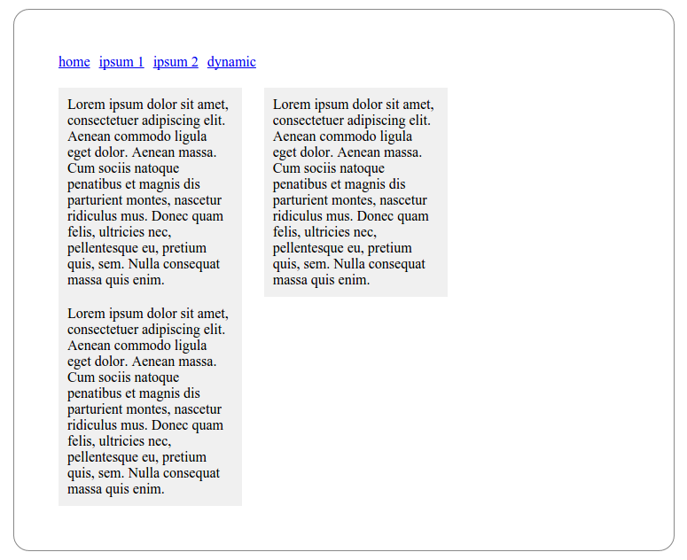

# protobatser
Programmer's alternative to prototyping tools like Aczure.

## How 

With one single htmlfile you can make a multipage layout to show your clients. 
Really handy for brainstorm sessions about a new website. 
It helps people's imagination of a website, and prevents overspecification/overdocumentating.

## Why

Because in some cases jamming simple HTML/CSS can be quicker for developers, especially:

* with usage of zencoding
* when a developer does not need a fullfledged GUI for a simple prototype
* when they want to update it live from a terminal

## Features

* multipage website in one single index.html !
* automatic generation of menu (navigation)
* ability to enhance/inject zencode snippets dynamically per menuitem
* simple smarty-like template engine for dynamic content

## Screenshot

## Howto

Well just get the source, include protobatser.js in our index.html, and thats all! Example for a multipage layout:

    var prototype = { name: "Your site",
                      menu:     "<ul>{$menu}</ul>

",
                      menuItem: "<li><a href='{$href}'>{$title_menu}</a></li>",
                      pages: [
                               { title: "Home",         title_menu: "home",    html: "div#frame>div#menu+div#content^text=Lorem ipsum dolor sit amet 0.+div#left+div#right"},
                               { title: "Lorem ipsum1", title_menu: "ipsum 1", html: "div#frame>div#menu+div#content^text=Lorem ipsum dolor sit amet 1.+div#left+div#right"},
                               { title: "Lorem ipsum2", title_menu: "ipsum 2", html: "div#frame>div#menu+div#content^text=Lorem ipsum dolor sit amet 2.+div#left+div#right"},
                               { title: "Dynamic",      title_menu: "dynamic", html: "div#frame>div#menu+div#content^text=Lorem ipsum dolor sit amet 3. {$foo}"},
                             ]
                     }

Now you will have a 4-page website prototype! See the source for more advanced examples.
